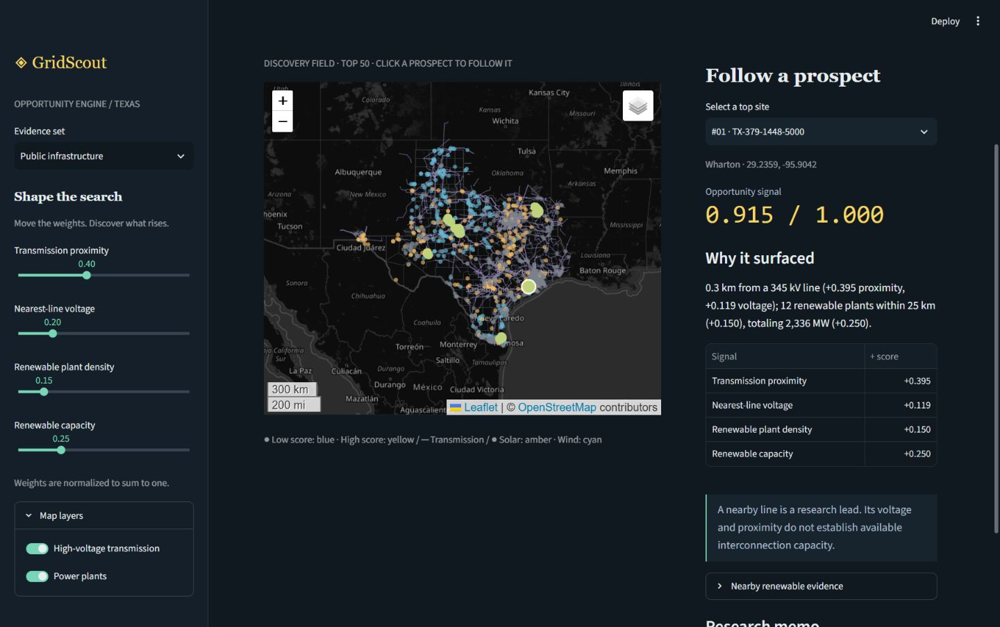

# GridScout

**A machine for discovering battery storage opportunity in Texas.**

[](https://github.com/gauravch-code/GridScout/actions/workflows/ci.yml)

GridScout scans a 5 km grid, finds infrastructure signals, ranks prospects with a transparent formula, and turns the leading sites into evidence-backed research memos. Change the weights and watch different places surface. Follow a map pin to see exactly why it ranks.

This is a portfolio prototype for infrastructure intelligence: messy public data becomes spatial features, explainable decisions, and a shorter first research pass. It screens research leads; it does not establish interconnection feasibility or investment returns.



## Run it

Python 3.11+ is required; this build was verified with Python 3.12. Use a virtual environment. All commands below run from this repository's root.

`requirements.txt` defines compatible dependency ranges; `requirements.lock.txt` records the exact versions used for the verified Windows/Python 3.12 build. Use `pip install -r requirements.lock.txt` to reproduce those versions when compatible with your platform.

```bash
python -m venv .venv
# macOS/Linux:
source .venv/bin/activate
# Windows PowerShell instead:
# ./.venv/Scripts/Activate.ps1
python -m pip install -r requirements.txt
python -m gridscout demo
python -m streamlit run app.py
```

Open the printed localhost URL. The demo is deterministic (seed 42), fictional infrastructure on an illustrative Texas outline, clearly labeled throughout the app and memos. No API key is needed. If public candidates are present, the app defaults to public evidence instead.

On Windows, `./scripts/run.ps1 setup`, `demo`, `data`, `app`, `test`, `sources`, and `memos` provide shortcuts. On systems with Make, use `make setup demo app` inside an activated environment.

### Public data

```bash
python -m gridscout verify-sources
python -m gridscout pipeline --download
python -m gridscout features
python -m streamlit run app.py
```

Downloads are cached in `data/raw`. Existing files are reused; to refresh, move them to an archive folder and rerun. The pipeline never silently substitutes a different source. `verify-sources` checks ZIP signatures and transmission schema/sample geometry, and records evidence in `docs/source-verification.json`. A valid link does not establish dataset freshness.

For offline processing, place the three named files from `config/sources.json` in `data/raw` and run `python -m gridscout pipeline` without `--download`. Alternatively use `--raw-dir /path/to/files --output-dir /path/to/clean`, followed by `python -m gridscout features --data-dir /path/to/clean`. The app's public path is `data/processed`; custom paths are supported by the CLI. Transmission input is GeoJSON with a declared CRS and a numeric `VOLTAGE` field in kV. Counties use `STATEFP`, `GEOID`, and `NAME`; EIA input is the unmodified annual ZIP. Update `config/sources.json` if filenames or URLs change.

### Research memos

Copy `.env.example` to `.env` and add your own `OPENAI_API_KEY`. Set `OPENAI_MODEL` to a model available to your account that supports Responses structured outputs. No credentials are embedded in the repo, and `.env` is ignored by Git.

```bash
# Free deterministic briefs, saved to data/processed/research:
python -m gridscout memos --top 3
# LLM-prioritized memos, explicit API use:
python -m gridscout memos --top 3 --llm
# Synthetic briefs:
python -m gridscout memos --data-dir data/demo --top 3
```

The app also writes a selected site's memo on demand. It never generates paid memos merely because a slider moved. The default limit is three uncached API attempts per CLI run or Streamlit session; set `GRIDSCOUT_MAX_MEMOS` explicitly to change it. Failed calls count against the cap, SDK retries are disabled, and output is limited to 1,200 tokens per request. This bounds calls and output tokens, not a dollar amount. Starting another process/session starts a new budget. Model access and billing depend on your account.

The memo agent assembles the site's features, nearest-line attributes, nearby renewable records, source provenance, and a supplied risk/check catalog. The LLM chooses priorities and ordering via a constrained schema. Python renders factual sentences from the packet, validates every cited field, and rejects unsupported strengths. The agent has no browsing tools. This deliberately trades free-form prose for auditable facts. A displayed source field resolves in the saved JSON evidence packet; it is not a claim that a source establishes feasibility.

Memos are content-addressed by evidence, source hashes, weights, model, and prompt version in `data/memos`. Changed evidence invalidates the cache. Deterministic briefs use a separate cache identity and are labeled as having no LLM writer. An actual paid model call remains to be verified with your key; the API integration and budget behavior are tested using a fake client. The implementation follows [official OpenAI structured-output documentation](https://developers.openai.com/api/docs/guides/structured-outputs?api-mode=responses).

## Sources and provenance

Source selection confirmed with the project owner on October 8, 2026. Direct payload verification is saved in [source-verification.json](docs/source-verification.json).

| Data | Download / service | Vintage and interpretation |
| --- | --- | --- |
| Electric transmission lines, HIFLD-derived copy | [ArcGIS feature service](https://services2.arcgis.com/LYMgRMwHfrWWEg3s/arcgis/rest/services/HIFLD_US_Electric_Power_Transmission_Lines/FeatureServer/0) · [Federal catalog](https://catalog.data.gov/dataset/electric-power-transmission-lines) | Public ArcGIS copy with `VOLTAGE`, `OWNER`, `STATUS`, and `SOURCEDATE`. Metadata reports underlying data last edited September 20, 2022; service edited June 11, 2024. **Not a current grid inventory.** Individual source dates vary. |
| Plant locations and generators | [EIA-860 2025 ZIP](https://www.eia.gov/electricity/data/eia860/xls/eia8602025.zip) · [EIA source page](https://www.eia.gov/electricity/data/eia860/) | Annual 2025 plant and generator workbooks. Uses operating (`OP`) generators; solar `SUN` and wind `WND` nameplate capacity. Plant locations are not connection points. |
| Texas counties | [TIGER/Line 2025 county ZIP](https://www2.census.gov/geo/tiger/TIGER2025/COUNTY/tl_2025_us_county.zip) · [Census directory](https://www2.census.gov/geo/tiger/TIGER2025/COUNTY/) | National county boundaries filtered to `STATEFP=48`, all 254 Texas counties. County boundaries can include water. |
| Optional future queue diligence | [LBNL Queued Up](https://emp.lbl.gov/queues) · [2026 edition announcement](https://eta.lbl.gov/publications/queued-2026-edition-characteristics) | 2026 edition describes queues through end of 2025. **Not downloaded, joined, or used in scores.** Queue location precision and status need dedicated cleaning before spatial inference. |

The federal HIFLD catalog is still discoverable but does not provide a usable download in the verified entry. The working ArcGIS copy is the explicit public substitute. Its metadata and original HIFLD source fields are preserved; it is not presented as newly surveyed infrastructure. EIA-860M is a possible later update, but the annual EIA-860 workbook is a consistent baseline. The 2025 Census archive was verified; the project does not claim it is the newest possible boundary vintage.

Public data is free to access. Keep attribution and check publisher terms before redistribution. Map tiles require internet and show OpenStreetMap attribution; a display filter gives them a muted dark appearance. Standard OSM tiles need no API key for this modest interactive prototype; respect the [OSM tile usage policy](https://operations.osmfoundation.org/policies/tiles/) and use a suitable provider for production traffic. There is no tile scraping or offline prefetch. Offline scoring and local-file processing do not require map tiles; the base map does.

## Pipeline and geospatial decisions

1. Verify sources, download ZIPs atomically, and fetch transmission object-ID batches. Batch completeness checks prevent ArcGIS record limits from silently dropping features. A broad Texas envelope is fetched, then exactly filtered against the projected Texas boundary plus a 25 km buffer. Cross-border infrastructure is retained.
2. Repair invalid geometries; drop empty, incompatible, or nonfinite geometries. Unknown/nonpositive voltage sentinel values become null and remain visible in the audit, but cannot be nearest high-voltage evidence. Known inactive, proposed, under-construction, and out-of-service lines are excluded. Unknown service status remains an explicit diligence issue. Exact normalized geometry-plus-voltage duplicates are dropped; circuits with different voltages remain distinct.
3. Read EIA headers adaptively, deduplicate plants and generator IDs, exclude nonoperating units, and aggregate renewable capacity once per unique plant. Hybrid plants count once in the total renewable count; they may appear in both solar and wind counts. Bad coordinates and capacities are logged. No missing capacity is imputed as known zero.
4. Project every layer to **EPSG:3083, NAD83 / Texas Centric Albers Equal Area, in meters**. This regional projection is suitable for coarse Texas screening; its distances are planar approximations, not surveyed or geodesic lengths. Distance helpers reject latitude/longitude and mismatched CRSs.
5. Create globally anchored 5,000 m squares, clip at Texas boundaries, and use an interior representative point per cell. Boundary cells have smaller areas. All features are computed from that point, not the whole cell. `--cell-size` allows coarser grids (minimum 1 km); site IDs include cell size.
6. Find the nearest line with known voltage ≥115 kV using spatial indices. Equal-distance ties select higher voltage, then line ID. Spatial `dwithin` joins count operating solar/wind plants at distance ≤25,000 m and sum their renewable nameplate MW. Evidence includes exact plant IDs and distances.

Clean layers, grid cells, and candidate points are saved as GeoParquet. `manifest.json` records source filenames, URLs, SHA-256 hashes, processing time, CRS, and each cleaning count. Map line/boundary simplification is for display only; feature distances use unsimplified geometry. The raw files and generated data are ignored by Git.

The verified October 8, 2026 build produced **28,414 candidates**, **5,883 transmission features**, **1,047 operating plants**, and **254 Texas counties**. The leading default-weight screening points fall in Wharton, Scurry, and Nolan counties; these are research leads under this formula, not independently validated development sites. Review the [cleaning audit](docs/pipeline-audit.json), [top 50 snapshot](docs/top-50-snapshot.csv), [example evidence packet](docs/example-evidence.json), and [example no-API memo](docs/example-memo.md).

## Explainable scoring

Scores use fixed anchors rather than dataset min/max. Each signal is clipped to [0,1], and weights are normalized to sum to one. Defaults live in [config/scoring.json](config/scoring.json).

| Signal | Normalized feature | Default weight |
| --- | --- | ---: |
| Transmission proximity | `clip(1 − distance_m / 25,000)` | 0.40 |
| Nearest-line voltage | `clip((kV − 115) / (500 − 115))` | 0.20 |
| Renewable plant density | `clip(unique_plant_count / 12)` | 0.15 |
| Renewable capacity | `clip(renewable_nameplate_MW / 2,000)` | 0.25 |

`score = Σ(normalized_weight × normalized_signal)`.

Every per-feature contribution is stored and their sum equals the score. Example: proximity +0.32, voltage +0.12, plant density +0.05, capacity +0.08 yields 0.57. All-zero weights are rejected. Missing values contribute zero; the pipeline fails if no qualifying high-voltage evidence exists. Ties in final scores use stable site-ID order. A score is a heuristic priority for research, not a probability of success. Voltage is used as a relative screening preference, not a capacity estimate. There are no unsupported negative load or flood penalties.

## Repository

```text
app.py                     Streamlit discovery experience
config/                    Source links, normalization anchors, weights
gridscout/pipeline.py       Downloads, workbook cleaning, audit, provenance
gridscout/features.py       Candidate grid, meter-based spatial features
gridscout/scoring.py        Weighted ranking and explanations
gridscout/maps.py           Folium map and selectable prospects
gridscout/memos.py          Evidence packet, LLM plan, grounded rendering, cache
gridscout/demo.py           Deterministic synthetic dataset
tests/                     Distance, cleaning, scoring, agent, app tests
scripts/run.ps1            Windows task runner
data/raw/                  Download cache (ignored)
data/processed/             Public GeoParquet and generated research (ignored)
data/demo/                  Synthetic data (ignored)
docs/                      Screenshot, source checks, sample evidence and brief
```

## Tests

```bash
python -m gridscout demo
python -m pytest -q
```

Tests cover scoring anchors, weight effects, additive explanations, clipping, stable normalization, nearest high-voltage distance, radius inclusion, distance ties, CRS rejection, clipped-cell interior points, missing data, reversed-line duplicates, operating-generator aggregation, memo citation validation, cache invalidation, failed-attempt budgets, live slider reranking, and no-API memo generation. App tests skip if demo data has not been prepared. No test calls a paid API. On restricted hosts, pass `--basetemp` with a writable scratch directory.

## Honest limitations

- The transmission copy is old and has unknown voltages/statuses. GridScout excludes unknown voltages from HV features; it does not infer them from broad voltage-class labels. Voltage and physical distance cannot reveal hosting capacity, upgrade cost, queue position, rights to tap a line, or a feasible substation connection.
- Texas includes several grid jurisdictions; this tool does not assign ERCOT membership or assume every candidate connects to ERCOT.
- A grid point is not a parcel. County boundaries can include water and no land, slope, road, parcel, flood, protected-area, or developability exclusion is applied. Boundary points and county names describe geography only.
- Renewable proximity and nameplate capacity do not establish curtailment, congestion, prices, dispatch patterns, or battery revenues. Count and capacity signals are correlated; weights are judgments, not trained or calibrated predictions.
- Annual plant data and the transmission snapshot have different vintages. Operational changes after those dates are not captured. Plant coordinates and infrastructure records can be imprecise.
- Adjacent high-scoring cells can represent the same corridor; the top 50 is not a diversified shortlist. Add spatial clustering before outreach or fieldwork.
- EPSG:3083 provides regional planar distance approximations. Grid resolution is coarse and nearest-point features can differ elsewhere within the same cell.
- The memo summarizes supplied evidence and known unknowns. It performs no external research, permitting investigation, land search, or interconnection study. The LLM's choices are constrained; factual prose is template-rendered.

## Next steps

Add a provider-verified substation/line inventory with update timestamps; cluster neighboring prospects; join properly geolocated interconnection requests with status handling; add FEMA flood and land/parcel screens; incorporate nodal congestion and revenue features; measure ranking sensitivity and geodesic distance error; evaluate top leads against developer-reviewed outcomes. These additions should create explicit source-backed features rather than silently imply feasibility.
